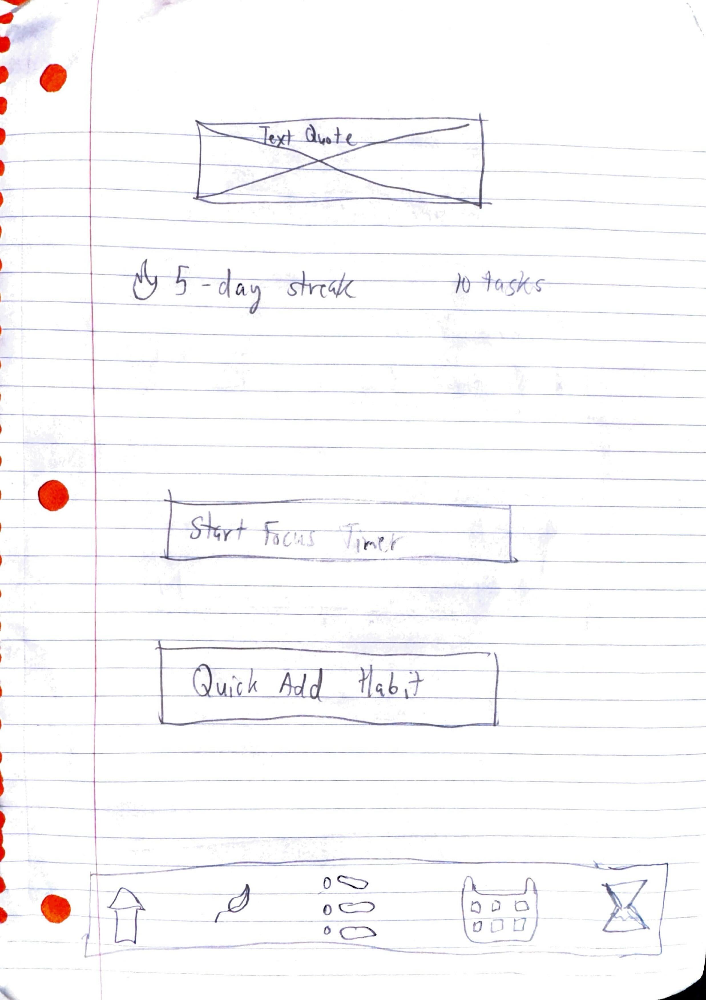
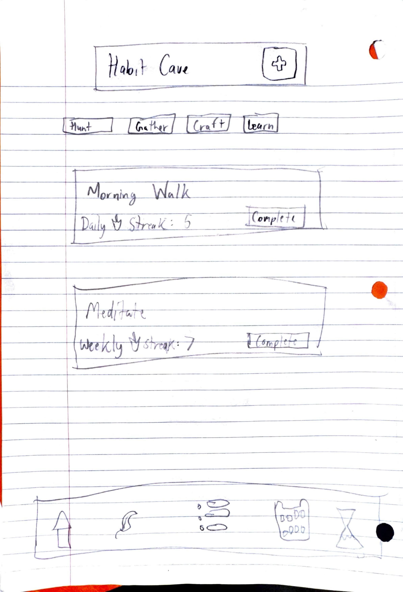
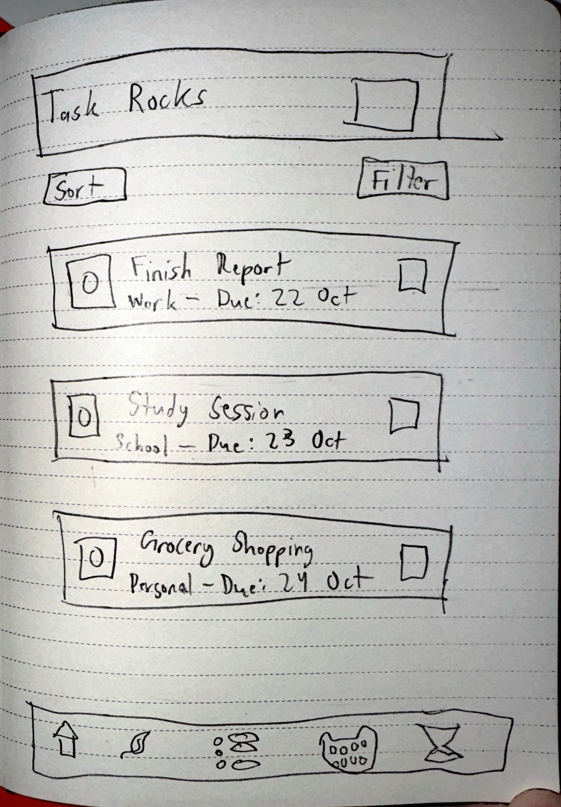
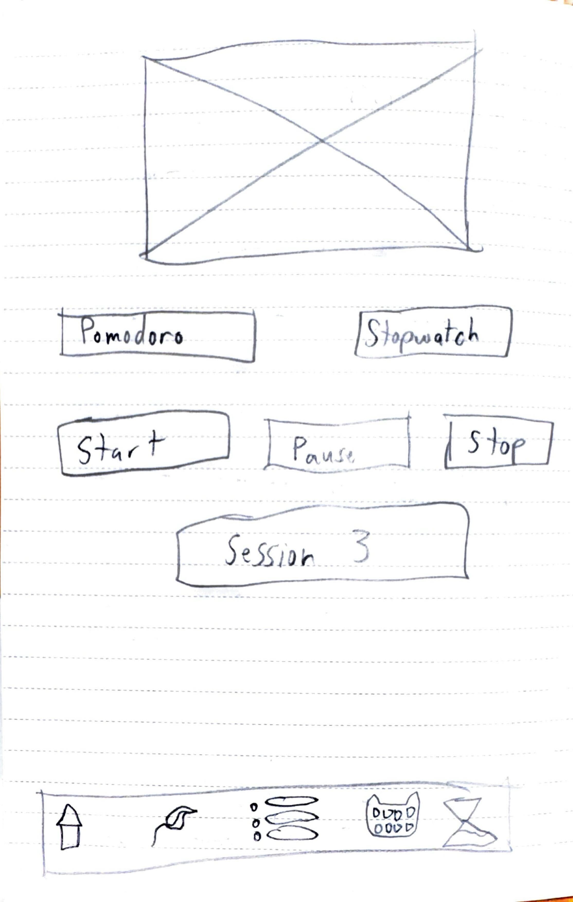
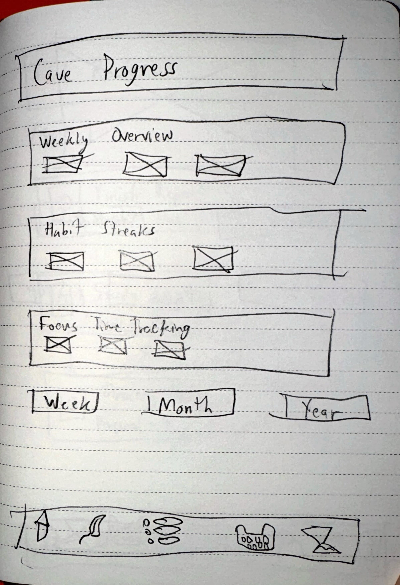

# **CaveTracker**

## Table of Contents

1. [App Overview](#App-Overview)
1. [Product Spec](#Product-Spec)
1. [Wireframes](#Wireframes)
1. [Build Notes](#Build-Notes)

## App Overview

### Description 

**CaveTracker is a unique productivity app with a caveman aesthetic that combines habit tracking, task management, calendar integration, and focus timers. Users can track their daily habits with customizable frequencies, manage tasks with categories and priorities, view everything on an integrated calendar, and use Pomodoro or stopwatch timers for focused work sessions. The app features a distinctive stone-age UI with cave paintings, stone textures, and fire animations, while providing daily motivational quotes to keep users inspired on their productivity journey.**

### App Evaluation

<!-- Evaluation of your app across the following attributes -->

- **Category:** Productivity & Lifestyle
- **Mobile:** Essential mobile experience with notifications, offline functionality, and touch-optimized caveman UI. The primitive aesthetic and timer features work perfectly on mobile devices.
- **Story:** Appeals to users who want productivity tools but are tired of bland, corporate interfaces. The caveman theme makes habit tracking and task management fun and engaging while maintaining full functionality.
- **Market:** Targets productivity enthusiasts, students, and anyone looking for a unique take on habit tracking. Large market potential as productivity apps are extremely popular, but few offer such a distinctive visual identity.
- **Habit:** Designed for daily use with habit tracking, task management, and focus sessions. The engaging caveman theme and streak counters encourage regular interaction and long-term habit formation.
- **Scope:** Well-defined scope perfect for intro development. Core features are achievable while the unique UI provides an interesting technical and creative challenge. Optional features allow for future expansion.

## Product Spec

### 1. User Features (Required and Optional)

Required Features:

- **Habit Tracking:** Create, edit, and delete habits with different frequencies (daily, weekly, monthly, custom)
- **Task Management:** Add tasks with categories, due dates, priority levels, and completion tracking
- **Calendar Integration:** View habits and tasks on a standalone calendar interface
- **Pomodoro Timer:** Adjustable focus and break times with fire animation
- **Stopwatch Mode:** Track continuous focus sessions with pause/resume functionality
- **Daily Quotes:** Fetch and display motivational quotes from API in cave wisdom format
- **Notifications:** Reminders for habits, task deadlines, and timer alerts
- **Categories:** Organize tasks and habits with custom categories

Planned Stretch Features:

- **Habit Streak Rewards:** Unlock cave paintings or achievements for long streaks
- **Advanced Statistics:** Weekly/monthly reports with detailed analytics
- **Custom Timer Sounds:** Different drum beats and primitive sounds
- **Habit Templates:** Pre-made habit suggestions with caveman themes
- **Export Data:** Share progress as stone tablet images
- **Widget Support:** Home screen widgets for quick habit checking
- **Cloud Backup:** Sync data across devices (future expansion)

### 2. Chosen API(s)

- **Quotable API (https://api.quotable.io/random)**
  - **Daily Cave Wisdom feature:** Fetch random motivational quotes to display on dashboard
  - **Offline caching:** Store quotes locally when API is unavailable
  - **Error handling:** Show default caveman wisdom when API fails

### 3. User Interaction

Required Feature

- **User taps "Add Habit" stone button**
  - => **Opens habit creation screen with frequency selection and category options**
- **User marks habit as complete**
  - => **Updates streak counter, shows fire animation, and saves completion to database**
- **User creates a new task**
  - => **Task appears in task list and on calendar with appropriate priority stone marker**
- **User starts Pomodoro timer**
  - => **Campfire animation begins, countdown starts, notification scheduled for completion**
- **User switches to stopwatch mode**
  - => **Timer interface changes to continuous tracking with pause/resume stone buttons**
- **User opens calendar view**
  - => **Displays stone circle calendar with carved markers for habits and tasks**
- **User views daily quote**
  - => **Stone tablet displays fetched quote with caveman styling and author attribution**

## Wireframes

<!-- Add picture of your hand sketched wireframes in this section -->

### Dashboard Home Screen

Main dashboard featuring the daily quote in a stone tablet format, quick stats with fire icons for streaks, and large action buttons for starting focus timer and adding habits. Bottom navigation shows all five main sections with cave painting style icons.

### Habit Tracking - "Sacred Fires"

The habit tracking screen displays habits as stone tablet cards with streak counters, completion buttons, and category filters (Hunt, Gather, Craft, Learn). Shows both daily and weekly habit examples with fire icons for streaks.

### Task Management - "Hunting Grounds"

Task list screen showing tasks as stone tablets with different sized rock icons for priority levels. Includes sort/filter options, completion checkboxes, and category tags. Each task shows title, category, and due date.

### Focus Timer Screen - "Battle Rage"

The focus timer interface featuring a large circular timer styled as a campfire, mode selection buttons for Pomodoro and Stopwatch, and session tracking. Stone-styled control buttons maintain the caveman aesthetic.

### Statistics Dashboard - "Cave Progress"

This wireframe shows the statistics screen with weekly overview charts, habit streaks displayed as growing fires, and focus time tracking. Features time period selectors (Week/Month/Year) and the signature caveman navigation bar.

### [BONUS] Digital Wireframes & Mockups

## Build Notes

Here's a place for any other notes on the app, it's creation 
process, or what you learned this unit!  

**Development Highlights:**
- Learned Jetpack Compose for modern Android UI development
- Implemented Room database for local data persistence
- Integrated Retrofit for API calls with proper error handling
- Created custom UI components with caveman aesthetic
- Developed notification system using WorkManager
- Built MVVM architecture with proper separation of concerns

**Creative Challenges:**
- Designing stone texture backgrounds and cave painting icons
- Creating smooth fire animations for timer and streak features
- Balancing playful caveman theme with professional functionality
- Implementing responsive layouts that work on different screen sizes

**Technical Learning:**
- Coroutines for asynchronous programming
- Navigation Compose for screen transitions
- Custom theming with Material Design 3
- API integration with offline fallback strategies

For Milestone 2, include **2+ Videos/GIFs** of the build process here!

## License

Copyright **2024** **Your Name**

Licensed under the Apache License, Version 2.0 (the "License");
you may not use this file except in compliance with the License.
You may obtain a copy of the License at

    http://www.apache.org/licenses/LICENSE-2.0

Unless required by applicable law or agreed to in writing, software
distributed under the License is distributed on an "AS IS" BASIS,
WITHOUT WARRANTIES OR CONDITIONS OF ANY KIND, either express or implied.
See the License for the specific language governing permissions and
limitations under the License.